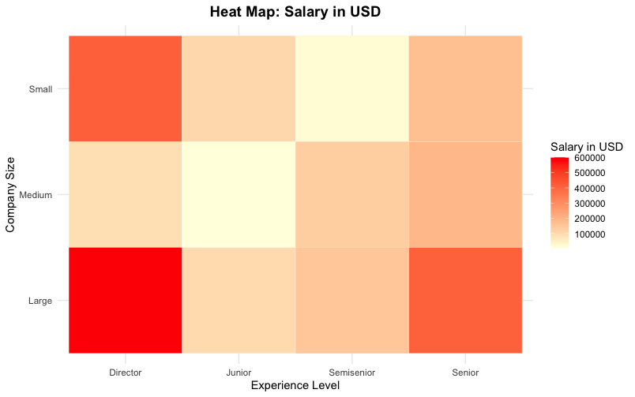

# Data Science Jobs Salaries 

## 📌 Descripción
### Context

The **data science profession** has experienced significant growth since 2019, with an increasing number of people entering the field. This study explores three key questions: **What does a data scientist do? Are there different types of roles within data science? Why is it in such high demand?**

A data scientist's role centers on **collecting, processing, and transforming large volumes of data**. Using **mathematical and statistical models**, they help businesses make **better decisions**.

**According to *El Economista* magazine, companies benefit from Data Science in the following ways:**

- **Segmentation of potential customers** to influence their purchasing decisions.
- **Feasibility and profitability analysis** of new products under development.
- **Greater understanding of customers and their preferences.**
- **Improved marketing campaigns.**
- **Better strategies for social media, e-commerce, and other digital channels.**
- **Identification and quantification of potential risks** related to customer loss.

**Data Science** merges **statistical, mathematical, and computational methods** with **communication skills** to present findings effectively. It draws data from both **online platforms** (social media, e-commerce sites, surveys) and **offline and hybrid sources** (spreadsheets, in-store customer interactions, focus groups, market research, and customer feedback).

This study will **analyze salaries in USD over two consecutive years**, investigate the **different roles in the industry**, and assess the **global impact** of this innovative profession.

## 📦 Tecnologías utilizadas
- Lenguaje: 
- Librerías:
  - `ggplot2` → Para visualización de datos 📊
  - `dplyr` → Para manipulación de datos 🔄
  - `readxl` → Para importar archivos Excel 📂
  - `pastecs` → Para estadísticas descriptivas 📈

